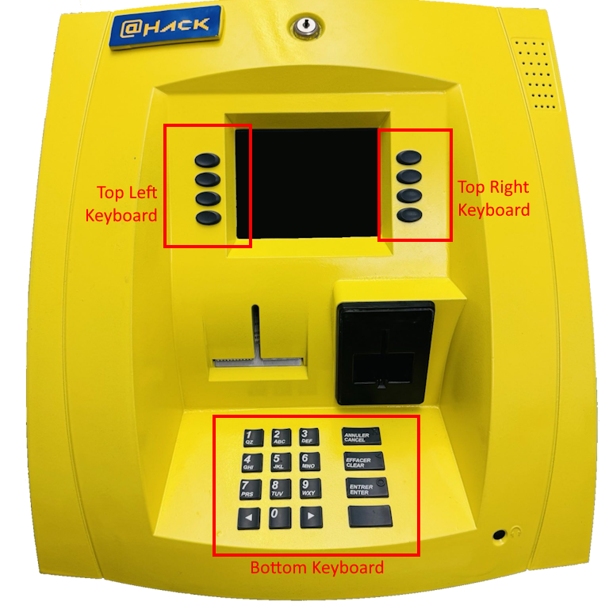

# ATM Challenge Utility

> Author: Hugo Kermabon-Bobinnec

Utilities for preparing and maintaining RFID challenges for @HackCTF 2025


## Requirements
- Linux machine, Ubuntu/Debian prefered - While WSL works fine (see Notes - WSL section), I did not have any luck with a VirtualBox VM on a Windows computer.
- RFID reader - @HackCTF 2025 uses some copies of ACS - ACR122U.
- Some Mifare Classic cards - @HackCTF 2025 uses some chinese version of Mifare Classic 1k with UID re-writable.

## Installation

- `sudo apt install libusb-dev libnfc-dev libnfc-bin libnfc-examples pcscd pcsc-tools build-essential libpcsclite-dev python3-dev`
- `source ./venv/bin/activate` or `pip install -r requirements.txt` if you have an env already.
- Test that your device is present in USB: `lsusb`
- Test a scan with `pcsc_scan`. Removing and putting the card should trigger state changes.

## Key Mapping

<p align="center">
</a>
</p>

## Top Left Keyboard
- `L1` ➡️ `j`
- `L2` ➡️ `s`
- `L3` ➡️ `l`
- `L4` ➡️ `a`

## Top Right Keyboard
- `R1` ➡️ `q`
- `R2` ➡️ `p`
- `R3` ➡️ `w`
- `R4` ➡️ `e`

### Bottom Keyboard
- `0-9` ➡️ `0-9`
- `Cancel` ➡️ `f`
- `Clear` ➡️ `h`
- `Enter` ➡️ `k`
- `Blank` ➡️ `o`
- `<` ➡️ `r`
- `>` ➡️ `y`

## Utilities

Here are a few utilities that we used at @HackCTF 2025

### Dump a card's content
`nfc-mfclassic r a u dump.mfd`

### Reset card
To reset a RFID card to the original state given a dump `chall.mfd`:
`nfc-mfclassic w a u chall.mfd`


### Check a card dump
`hexedit -l 16 dump.mfd`. This will show you line by line each block. Each sectors is composed of 4 blocks, the last block of the sector contains the keys and permissions, so do NOT mess it up.

### Change a card's UID
`nfc-mfsetuid <UID>`. UID is 4 bytes in hexadecimal, no spaces.


## Printer

To operate the printer; connect it through the USB port (the COM port makes the cable overheat for some reasons?)

- Install python-escpos: `pip install python-escpos[all]`
- Add a rule in to allow control of USB device:
```
# sudo nano /etc/udev/rules.d/99-escpos.rules
SUBSYSTEM=="usb", ATTRS{idVendor}=="0416", ATTRS{idProduct}=="5011", MODE="0666"
```
- `sudo udevadm control --reload-rules` and `sudo udevadm trigger`

You can then run `printer-test.py` for testing.


## Notes
Few notes, can be useful for the next people.


### Types of card
There are multiple types of UID re-writable Mifare Classic cards. Mainly, the UID on "CUID Gen2" cards can be completely re-written with regular commands (i.e., block 0 is the same as any other block).
However, at @HackCTF 2025, we used some "UID" card (also called Gen. 1), where UID is only rewritable through a "backdoor" command.


### WSL
If you want to use the RFID reader/writer with a WSL Linux machine, here's help:
- On a regular Windows terminal, do `usbipd list`. The `ACR122 Smart Card Reader` should be there. Note it's BUSID (in my case `2-7`)
- Open an administrator Windows terminal and run `usbipd bind --busid 2-7`. This will make the USB reader available to a WSL machine.
- Start your WSL machine, then in a regular Windows terminal, do `usbipd attach --wsl --busid 2-7`. This actually shared the device on with WSL (won't be available for Windows anymore). It seems that it actually shares it with all WSL machines at the same time.


### VirtualBox VMs
I did not have much luck with VirtualBox VMs, however there is probably a way to make it work. One thing I noticed is that the USB Controller should be set to `USB 3.0 (xHCI)` for the USB reader to even appear in the VM.


### Debug
- `lsusb` to check if the device is even attached
- `LIBNFC_LOG_LEVEL=3 <cmd>` to enable debug mode
